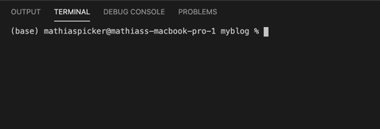

## Browse the document:

### 1. **[A deeper understanding 🧠](#a-deeper-understanding-of-makemy)** 

### 2. **[How to install and use makemy ⬇️](#how-to-use)**

### 3. **[API 💻](#api)**

### 4. **[How to write a post](#how-to-write-a-post)**

### 5. **[How to write a template](#how-to-write-a-template-for-your-posts)**

### 6. **[Working with the init-styling of a post](#working-with-the-init-css-styles-of-a-post)**

### 7. **[How to work with the allPosts.json file](#how-to-work-with-the-allpostsjson-file)**


#### Extra reading material: [Syntax Document - The syntax created by makemy](https://github.com/make-my/DOCS/blob/master/SYNTAX-DOCUMENT.md)


&nbsp;
&nbsp;
&nbsp;


# A deeper understanding of makemy

## What is makemy?

_"What about Jekyll? Isn't this kind of the same thing!?"_

Well, yes - **and no**.

makemy is build on the same principle: _"Markdown, HTML & CSS go in. Static sites come out ready for deployment."_
However, makemy is built for simplicity - a biiig scoop of simplicity. The core principles of makemys tools are to automatically generate the things you want, without needing lots of configurations, modules and extra stuff you don't want on your computer. If you want to create a new webpage out of your text-post, then makemy only really needs 2 things: your text-post and a template to wrap it in. Create your template so it matches your beautiful, personal website, and makemy will automatically insert the post where you have told it to - pre-styled and made responsively with CSS. makemy will also automatically create some useful things for you: 

- a folder named "posts" which will contain all the generated posts.
- an allPosts.json file which contains some information about all your posts [read more](#what-is-stored-in-here)


## Why should i use makemy?

In addition on keeping a focus on simplicity, makemy also cares about user-feedback and speed. With a Human Centered Api and useful feedback messages while using the tools, becomes makemy a breathe of fresh air in all your day-to-day error messages. _Have you forgot to insert the --name at the top of your post?_ makemy will tell you this and stop the execution. _Have you created a website before that is scary alike the one you've just generated (because you maybe forgot to change the content you copy pasted)?_ makemy will tell you. _Did you try to update an page without using the `update:true` option?_ makemy will tell you what to do. _Did you forget any of the options or misspelled any of them?_ makemy will give feedback on which options were incorrect.

While keeping focus on making the usage of makemy simple, the tool also cares about speed and performance. With few dependencies and modern async/await is the tool just over 100kb. Try it out for yourself, and see what you think.


# How to use:

_Note: Some of the gifs used are somewhat large, so they might take some time do download._

## 1️. Install with `npm install makemy`



&nbsp;

## 2️. Run `makemy-init` to get a pre-made "generator" folder in your project


&nbsp;

## 3. Create your post and template in the project - and run makemy.page()


&nbsp;
## Done! ✅

### Now you can create as many posts as you wish! Just run the makemy function to create their HTML-pages.

#### Example of two generated pages, one with markdown and one with the makemy sugar-syntax:


&nbsp;

#### The url to a post would be structured like this: `https://mycoolsite.github.io/posts/post_about_waffles`

&nbsp;

&nbsp;

# API

#### - **`makemy.page(dir, options:object)`**

#### - **`makemy.json(dir, options:object)`**

#### - **`makemy.templates(dir, options:object)`**

&nbsp;

## makemy.page(path-to-directory, [options])

### `options`:

#### REQUIRED OPTIONS:

| Name              | Type     | Description                                                                            |
| ----------------- | -------- | -------------------------------------------------------------------------------------- |
| **template**      | _String_ | name of the HTML file used as the template for the page. Do not write the .html suffix |
| **sourcefoulder** | _String_ | name of folder where the written post is.                                              |
| **postname**      | _String_ | name of post.                                                                          |

#### VOLUNTARY OPTIONS:

| Name          | Type      | Description                                                                                                             |
| ------------- | --------- | ----------------------------------------------------------------------------------------------------------------------- |
| **location**  | _String_  | path (relative to `__dirname`) to where the "posts"-folder should be created.                                           |
| **extension** | _String_  | type of extension used on the document.                                                                                 |
| **update**    | _Boolean_ | choose if a post should be updated (if you want to re-generate the same post), is false by default                      |
| **sugar**     | _Boolean_ | set to true if you want to use the sugar-parser created by makemy [SYNTAX DOCUMENT (SUGAR-PARSER)](/SYNTAX-DOCUMENT.md) |
| **css**      | _Boolean_ | choosing if you want to use the init-stylesheet provided by makemy, is true by default |

&nbsp;

#### Example of using makemy.page to update an already existing page:


#### Code example:

```js
const makemy = require('makemy');

const options = {
  template: 'template',

  sourcefolder: 'posts',

  postname: 'my-first-post',

  location: '../',

  update: true
};

makemy.page(__dirname, options);
```

&nbsp;

## makemy.json(path-to-directory, [options])

#### NOTE: ONLY USE IF YOU WANT TO UPDATE/REGENERATE THE JSON FILE. NO NEED TO RUN THIS FUNCTION WHEN YOU CREATE A PAGE AS THE makemy.page FUNCTION DOES THIS BY ITSELF.

### `options`:

#### VOLUNTARY OPTIONS:

| Name      | Type     | Description                                                                                      |
| --------- | -------- | ------------------------------------------------------------------------------------------------ |
| **order** | _String_ | what order the posts in the json file should be. Options are ascending (default) and descending. |

&nbsp;

#### Example:

```js
const options = {
  order: 'descending'
};

makemy.json(__dirname, options);
```

&nbsp;

## makemy.templates(path-to-directory, [options])

### NOTE: THIS IS USED FOR UPDATING TEMPLATES ON ALREADY GENERATED PAGES

### `options`:

#### REQUIRED OPTIONS:

| Name         | Type                | Description                                                                                                       |
| ------------ | ------------------- | ----------------------------------------------------------------------------------------------------------------- |
| **template** | _String_            | name of the new HTML template                                                                                     |
| **posts**    | _String_ or _Array_ | select which posts should have their template updated. Can either be an array with names or just the string 'all' |

&nbsp;

#### Example:

```js
const options = {
  template: 'summer-template',
  posts: 'all'
};

makemy.template(__dirname, options);
```

&nbsp;

&nbsp;


# How to write a post

There's many different ways to create text-documents and write them in a way that a computer understands. However, to not make things too difficult, makemy supports 2 different types of syntaxes:

- Markdown
- [makemys sugar-syntax](https://github.com/make-my/DOCS/blob/master/SYNTAX-DOCUMENT.md)

When writing a post, there's only two things that are required to make makemy happy - these are the core-informations about a post. These two are named "name" and "introduction". The way you set these core-informations are by writing them at the top of the document, it's as simple as that. Here's how to write them correctly:

1. Initialize the info with the -- trigger
2. Write the name first, then the introduction.

### Example:

```
--name Here is the name of my post
--introduction ...and here is the introduction to my post. This part can be a little longer, 
but shouldn't be too long as you should make the reader interested with just a couple of sentences.

```

After that you can write your document just how you would write any normal markdown document (or with the sugar-syntax if you prefer that one).


&nbsp;

&nbsp;


# How to write a template for your posts

One of the core ideas for allowing makemy to be an easy tool to use is by making the steps from the _"here is how i would like my page to look like"_ input to _"here's your page, exactly how you wanted"_ output as easy and short as possible. The way makemy does this is by taking in a normal HTML page, styled exactly how you like it, with only 1 trigger-tag: `<POST>`.

Wherever you place the `<POST>` tag is where your post will be inserted, it's as easy as that!

## Short and simple example of a template:

```html

<!DOCTYPE html>
<html lang="en">
  <head>
    <meta charset="UTF-8" />
    <meta name="viewport" content="width=device-width, initial-scale=1.0" />
    <title>Welcome to my post!</title>
    <link rel="stylesheet" href="styles.css" /></head>
  <body>
    <nav>This is my header</nav>
    
    <POST>
      
    <footer>This is my footer</footer>
  </body>
</html>

```

&nbsp;

&nbsp;


# Working with the init CSS-styles of a post

All posts created with makemy comes shipped with a pre-defined stylesheet for the components used in the post. However, overwriting these styles are pretty easy. Just overwrite them in your own CSS-stylesheet used in the template! Thanks to css order of precedence and makemy automatically inserting the CSS-stylesheet above yours, will your CSS-code overwrite the init-stylings provided by makemy. If you want to use your completely own styling, can you set the option `css: false` in the options when creating a page.

## Full list of class-names and their styles used for the post-section:

```css

/* Styling for the post-section wrapper */
.post-section {
  width: 100%;
  min-height: 50rem;
  margin-bottom: 4rem;
  font-size: 2.5rem;
  --black: rgb(37, 37, 37);
  --white: white;
  color: var(--black);
  background-color: var(--white);
}

/* Setting post-section to dark mode  */
@media (prefers-color-scheme: dark) {
  .post-section {
    --black: white;
    --white: rgb(37, 37, 37);
  }
}

/* Every section in post set to same width and with some spacing between */
.post-section > * {
  width: 60%;
  margin: 4rem auto 0;
  line-height: 1.2;
  box-sizing: border-box;
  position: relative;
}

.created-at {
  position: relative;
  display: block;
  width: 60%;
  margin: 2.5rem auto -2rem;
  opacity: 0.7;
  font-size: 1.15em;
}

@media only screen and (max-width: 62.5em) {
  .post-section {
    font-size: 2.2rem;
  }

  .post-section > * {
    width: 80%;
  }
}

/* Every paragraph should also have some additional space */
.post-section .text-section > p {
  margin: 1.8rem auto;
}

/* Styling for links */
.post-section a {
  color: rgb(25, 125, 192);
  border-bottom: 2px solid rgba(25, 125, 192, 0.5);
  text-decoration: none;
  padding: 0 0.2rem;
}
.post-section a:hover {
  background-color: rgba(25, 125, 192, 0.1);
  border-bottom: 2px solid currentColor;
}

/* HEADERS */

.post-section .title {
  margin-top: 5rem;
}

.post-section h1 {
  font-size: 2.6em;
  text-decoration: underline;
}

.post-section h2 {
  font-size: 2em;
}

.post-section h3 {
  font-size: 1.4em;
}

.post-section h4 {
  font-size: 1.2em;
}

.post-section h5 {
  font-size: 1.05em;
}

.post-section h6 {
  font-size: 0.9em;
}

/* QUOTE BLOCKS */

.big-quote {
  display: block;
  font-style: italic;
  padding: 2.5rem;
  background-color: #fff0d354;
  font-weight: bold;
  font-size: 1.3em;
}

.big-quote .quotee {
  text-align: right;
  font-weight: normal;
  margin: 3rem 3rem 0;
}

/* HTML ITEMS */

pre,
.code-tag,
.code-tag-flow {
  background-color: #282c34;
  color: white;
}

pre,
.code-tag {
  display: block;
  padding: 1.5rem;
  margin: 1rem auto;
}
.code-tag-flow {
  display: inline;
  padding: 0.85rem;
}

```

&nbsp;

&nbsp;


# How to work with the allPosts.json file

## What is stored in here?

One of the ways makemy allows for easy deployment and fetching of your posts without needing a server is by storing core information about them in a JSON file called `allPosts.json`. This file is located in the "posts"-folder together with your other posts, and stores these informations about every single post:

- The url of the post
- The name of the post
- The creation date in a readable string
- The creation date in milliseconds

## How the allPosts.json file is structured:

The JSON file contains one parent array called "posts". Here are all the core-informations about the posts stored in objects. When generating a page will it automatically be inserted into the first index of the array. If you want to choose how you want the posts to be sorted (newest or oldest first), can this be done with the [makemy.json()](#makemyjsonpath-to-directory-options) tool. 

```json

{
  "posts": [
    {
      "url": "posts/my-second-post",
      "name": "A post written entirely with the makemy sugar-syntax",
      "introduction": "You know, the sugar-syntax isn't that bad after all... i think.",
      "creationDate": "Tuesday 14th of April 2020",
      "creationDateMS": 1586887526873.5598
    },
    {
      "url": "posts/my-first-post",
      "name": "This is the first blog post i have created",
      "introduction": "You know how this post was created automatically? It's quite cool",
      "creationDate": "Friday 10th of April 2020",
      "creationDateMS": 1586515891051.72
    }
    ...
  ]
}

```


## How to get the data in the allPosts.json file:

### Here's an example on how to fetch all the posts and create "preview-modules" which are inserted into your page (only vanilla JavaScript):

```js

'use strict';

/**
 * Because we want to work asynchronously throughout the code
 * it's easiest (and safer) to just wrap our whole code in a async IIFE
 */

(async () => {
  // Function for fetching the JSON and parsing it.
  async function getPosts(url) {
    const response = await fetch(url, {
      method: 'GET',
      mode: 'cors',
      credentials: 'same-origin',
      headers: { 'Content-Type': 'application/json' }
    });
    return await response.json();
  }

  const url = location.origin;

  const postsJSON = await getPosts(`${url}/posts/allPosts.json`);

  const posts = postsJSON.posts;

  /**
   * Here's one solution to dynamically create previews of the posts into HTML-Element.
   * This function inserts every post in a wrapper, which then contains the title, introduction and created date for the post.
   */

  const postsSection = document.querySelector('main');

  const createPreviewContent = (element, className, content, wrapper) => {
    const previewContent = document.createElement(element);
    previewContent.classList.add(className);
    previewContent.textContent = content;
    wrapper.appendChild(previewContent);
  };

  function insertPostsToDOM(posts, parent) {
    for (const post of posts) {
      const previewWrapper = document.createElement('div');

      previewWrapper.classList.add('preview-wrapper');

      previewWrapper.addEventListener(
        'click',
        () => (window.location = `${url}/${post.url}`)
      );

      createPreviewContent('h3', 'preview-title', post.name, previewWrapper);
      createPreviewContent('p', 'preview-introduction', post.introduction, previewWrapper);
      createPreviewContent('time', 'preview-date', post.creationDate, previewWrapper);

      parent.insertAdjacentElement('beforeend', previewWrapper);
    }
  }

  insertPostsToDOM(posts, postsSection);
})(window);


```

